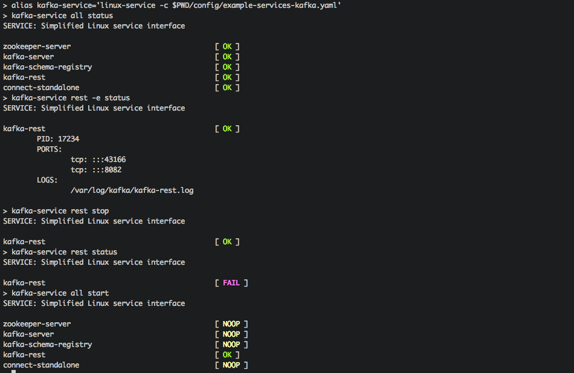

# Introduction

**linux-service** allows you to organize adhoc commands as 'Linux services' and control them with 'service interface', i.e. 



Each 'service' is defined as a collection of: 'start', 'stop' and 'status' commands in configuration file:

```YAML
kafka-server:
    sequence: 10
    user: oracle
    start: ${KAFKA_HOME}/bin/kafka-server-start ${KAFKA_HOME}/etc/kafka/server.properties >/var/log/kafka/kafka-server-confluent.log 2>&1 &
    stop: ${KAFKA_HOME}/bin/kafka-server-stop
    status: ps --no-headers -p $(ps ax | grep -i 'io\.confluent\.support\.metrics\.SupportedKafka' | grep java | grep -v grep | awk '{print $1}')
```

# Suggested first step

Defining appropriate shell **aliases** greatly simplifies running linux-service commands, i.e.:

```Bash
alias kafka-service='linux-service -c $CFG/config/my-kafka.yaml'

kafka-service all status
```

# Usage examples

(assumes that you created **myservice** alias)

## Start services

I.e.

```Bash
myservice hive start
```

This will start all services that have 'hive' in the name.

To start all services, run:

```Bash
myservice all start
```

Notes:

1. Services are started in the order of 'sequence'
2. No attempt is made to start already started services (you will see [NOOP] there)

## Stop services

I.e.

```Bash
myservice yarn stop
```

This will stop all services that have 'yarn' in the name.

To stop all services, run:

```Bash
myservice all stop
```

Notes:

1. Services are stopped in the reverse order of 'sequence'
2. No attempt is made to stop already stopped services (you will see [NOOP] there)

## Check service status

I.e.

```Bash
myservice impala status
```

This will check status for all services that have 'impala' in the name.

You can also display 'extended status', that includes 'open ports' and 'open log files', by running:

```Bash
myservice impala -e status
```

To check status for all services, run:

```Bash
myservice all status
```

# (Mandatory) configuration file

Services are defined in (YAML) configuration file with the following structure:

```YAML
service-1-name:
    sequence: [MANDATORY] Positive integer  # Defines start/stop order
    start:    [MANDATORY] Start command
    stop:     [MANDATORY] Stop command
    status:   [MANDATORY] Status command # Must return 'output' for 'successful' status

    user:     [OPTIONAL] UNIX user name # User name to start/stop service (if not specified, assumes: 'current user')
    pid:      [OPTIONAL] Command to find service process PID # Only needed in 'extended' mode to search for ports/logs
    wait:     [OPTIONAL] Positive integer # Seconds to wait after service starts/stops to let 'state' propagate

service-2-name:
    sequence: [MANDATORY] Positive integer  # Defines start/stop order
    start:    [MANDATORY] Start command
...
```

For example:

```YAML
zookeeper-server:
    sequence: 1
    user: root
    start: service zookeeper-server start
    stop: service zookeeper-server stop
    status: service zookeeper-server status
    pid: cat /var/run/zookeeper/zookeeper-server.pid

kafka-server:
    sequence: 10
    user: oracle
    start: ${KAFKA_HOME}/bin/kafka-server-start ${KAFKA_HOME}/etc/kafka/server.properties >/var/log/kafka/kafka-server-confluent.log 2>&1 &
    stop: ${KAFKA_HOME}/bin/kafka-server-stop
    status: ps --no-headers -p $(ps ax | grep -i 'io\.confluent\.support\.metrics\.SupportedKafka' | grep java | grep -v grep | awk '{print $1}')
    pid: ps ax | grep -i 'io\.confluent\.support\.metrics\.SupportedKafka' | grep java | grep -v grep | awk '{print \$1}'
    wait: 2
```

Commands are run in the current shell, so can include *environment variables*.

# Privileges

In 'default' mode, 'linux-service' does not need any special permissions, however if you supply 'user' keys to run services as specific users, make sure that current user has proper 'sudo' permissions.

In 'extended' mode (i.e. when running 'myservice all -e status' command), linux-service needs access to /proc/pid/fd and /proc/pid/net (by default: 'sudo -u root', you can cotrol the user with --user parameter).

It also makes use of standard Linux commands, such as: ps, grep, cat, file and sudo.

# Current limitations and assumptions

1. At the moment, 'linux-service' only operates on a single host, through sudo when necessary (although, extending it for 'remote hosts' is planned)
2. It was only tested on Linux (but there is a good chance it should work on other OS-s as well with some minimal modifications).
3. 'Extended status' mode assumes presense of (and access to): '/proc/pid/fd', '/proc/pid/net', so it will not work on systems where these are not present.
