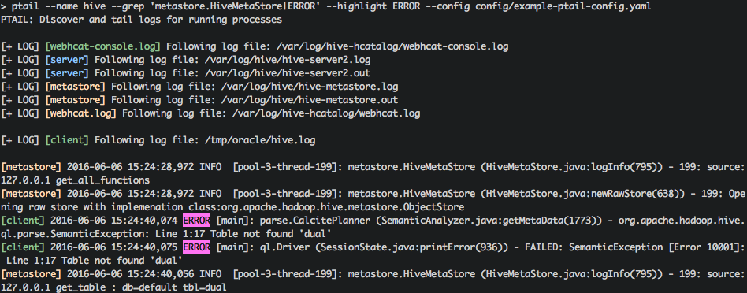

# Introduction

**ptail** is similar to UNIX **tail -f**, but uses 'processes' as a starting point.

That is: 

1. You supply 'pids' or 'name patterns' of processes that you want to monitor
2. 'ptail' discovers (text) log files opened by these processes ..
3. .. and starts 'following' them simultaneously, color coding output from each file
4. .. while optionally, filtering and/or highlighting the output



# Usage examples

## Discover and tail logs

For specific pids:

```Bash
ptail -p 3072 3109
```

For processes with specific 'name pattern'

```Bash
ptail --name hive
```

## Adjust 'discoverable' log names

```Bash
ptail --name hive --log-filter '.out'
```

Note that each discovered log file must still pass "is it a text file?" filter (with: 'file' command).

## Highlight keywords

```Bash
ptail --name hive --highlight ERROR
```

## Filter log lines

### Simple filter, a.k.a. 'grep'

```Bash
ptail --name hive --grep 'ERROR|WARN'
```

Just as a reminder, filters are 'regular expressions'.

### (experimental) 'Structured' filter

If you know the 'structure' of log file in advance, you can define it in configuration file and perform more complex queries.

I.e. the following ('hive client') log file:

```
2016-06-05 18:08:43,972 ERROR [main]: ql.Driver (SessionState.java:printError(936)) - FAILED: ParseException line 1:0 cannot recognize input near 'yahoo' '<EOF>' '<EOF>'
2016-06-05 18:11:34,797 DEBUG [Thread-0]: ipc.Client (Client.java:stop(1243)) - Stopping client
```

can be 'structured' into: ['ts', 'level', 'id', 'text'] columns, i.e.:

```Python
{
    ts: 2016-06-05 18:08:43,972
    level: ERROR
    id: main
    text: ql.Driver (SessionState.java:printError(936)) - FAILED: ParseException line 1:0 cannot recognize input near 'yahoo' '<EOF>' '<EOF>'
}

{
    ts: 2016-06-05 18:11:34,797
    level: DEBUG
    id: Thread-0
    text: ipc.Client (Client.java:stop(1243)) - Stopping client
}
```

with the following 'format':

```YAML
hive.log:
    format: '^(?P<ts>\d{4,4}\-\d{2,2}\-\d{2,2}\s+\d{2,2}:\d{2,2}:\d{2,2},\d{3})\s+(?P<level>\w+)\s+\[(?P<id>[^\]]+)\]:\s+(?P<text>.*)'
```

Then, each column can be queried independently, i.e.:

```Bash
ptail --name hive --filter level='ERROR|WARN' text=ParseException
```

# (Optional) configuration file

You can supply an optional configuration file to customize colors, labels and formats, i.e.:

```YAML
/tmp/oracle/hive.log:
    color: green
    label: client
    format: '^(?P<ts>\d{4,4}\-\d{2,2}\-\d{2,2}\s+\d{2,2}:\d{2,2}:\d{2,2},\d{3})\s+(?P<level>\w+)\s+\[(?P<id>[^\]]+)\]:\s+(?P<text>.*)'

hive-metastore:
    format: '^(?P<text>.*)'
    label: metastore
    color: yellow

ERROR:
    color: red
```

Configuration 'keys' (i.e. /tmp/oracle/hive.log) are regular expressions for (discovered) log names.
They are processed in the order they appear in configuration file and the first match wins (which means that you should put more specific patterns first).

# Privileges

'ptail' discovers log files by reading through '/proc/pid/fd' entries, so it needs access to these directories ('sudo -u root' by default, you can adjust 'sudo' user name with '--user' parameter).

It also makes use of standard Linux commands, such as: ps, grep, file and sudo.

# Current limitations and assumptions

1. 'ptail' is designed to work on Linux (however, presumably it should work on any UNIX that supports '/proc/pid/fd')
2. The tool is best suited to follow files that are either always open by the process or open/close infrequently
3. At the moment, 'ptail' is a single host tool (although, extending it to 'a cluster of hosts' is planned)
4. It would be cool to autodiscover log 'formats' as well, but alas, for now 'format' has to be supplied in configuration file
